# Manual de usuario — GEO ARTE CDMX

**Versión:** 2.0 · **Fecha:** julio 2026  
**Audiencia:** Ciudadano · Investigador · Autoridad  
**Plataforma:** aplicación web Next.js · **Datos:** padrón SECTEI, métricas territoriales y repositorio cualitativo

---

## Introducción

**GEO ARTE CDMX** es una plataforma de **inteligencia territorial** para consultar, analizar y —según el perfil— gestionar la infraestructura cultural de las **16 alcaldías** de la Ciudad de México.

Este manual está organizado en **tres guías por rol** más una sección común. Cada módulo incluye capturas de pantalla reales de la aplicación (carpeta `imagenes/`) para facilitar la consulta visual.

### ¿Qué encontrarás en este documento?

| Sección | Contenido |
|---------|-----------|
| [Parte I — Información común](#parte-i--información-común) | Interfaz, acceso, perfiles y matriz de permisos |
| [Parte II — Ciudadano](#parte-ii--manual-del-ciudadano) | Explorar mapa, guardar espacios, consultar datos públicos |
| [Parte III — Investigador](#parte-iii--manual-del-investigador) | Análisis, reportes, exportaciones e investigación cualitativa |
| [Parte IV — Autoridad](#parte-iv--manual-de-la-autoridad) | Administración del padrón, usuarios, capas y validaciones |
| [Anexos](#anexos) | KPIs, glosario, FAQ y documentación relacionada |

### Convención de imágenes

Las capturas se almacenan en `docs/cliente/imagenes/`. En este manual se referencian así:

```markdown

```

Puedes **agregar o sustituir imágenes** copiando nuevos archivos PNG a esa carpeta y actualizando la ruta en el texto correspondiente.

---

## Tabla de contenidos

### Parte I — Información común
1. [Convenciones y modos de operación](#1-convenciones-y-modos-de-operación)
2. [Interfaz global](#2-interfaz-global)
3. [Autenticación y los tres perfiles](#3-autenticación-y-los-tres-perfiles)
4. [Matriz de acceso por rol](#4-matriz-de-acceso-por-rol)

### Parte II — Manual del Ciudadano
5. [Resumen del perfil Ciudadano](#5-resumen-del-perfil-ciudadano)
6. [Inicio](#6-inicio)
7. [Proyecto](#7-proyecto)
8. [Mapa interactivo](#8-mapa-interactivo)
9. [Dashboard (consulta)](#9-dashboard-consulta)
10. [Cuestionario (consulta)](#10-cuestionario-consulta)
11. [Políticas públicas](#11-políticas-públicas)
12. [Soporte y contacto](#12-soporte-y-contacto)
13. [Mi perfil (Ciudadano)](#13-mi-perfil-ciudadano)

### Parte III — Manual del Investigador
14. [Resumen del perfil Investigador](#14-resumen-del-perfil-investigador)
15. [Dashboard avanzado y exportaciones](#15-dashboard-avanzado-y-exportaciones)
16. [Centro de reportes](#16-centro-de-reportes)
17. [Investigación y repositorio cualitativo](#17-investigación-y-repositorio-cualitativo)
18. [Mi perfil (Investigador)](#18-mi-perfil-investigador)

### Parte IV — Manual de la Autoridad
19. [Resumen del perfil Autoridad](#19-resumen-del-perfil-autoridad)
20. [Panel de administración](#20-panel-de-administración)
21. [Gestión del padrón y publicación](#21-gestión-del-padrón-y-publicación)
22. [Capas SIG y sincronización del mapa](#22-capas-sig-y-sincronización-del-mapa)
23. [Políticas, investigación y reportes (admin)](#23-políticas-investigación-y-reportes-admin)
24. [Usuarios, consultas y auditoría](#24-usuarios-consultas-y-auditoría)

### Anexos
- [A. Referencia de KPIs y gráficos](#anexo-a-referencia-de-kpis-y-gráficos)
- [B. Glosario](#anexo-b-glosario)
- [C. Preguntas frecuentes](#anexo-c-preguntas-frecuentes)
- [D. Documentación relacionada](#anexo-d-documentación-relacionada)

---

# Parte I — Información común

## 1. Convenciones y modos de operación

### 1.1 Modo demo vs. Supabase

| Indicador en pantalla | Significado |
|----------------------|-------------|
| **Modo demo** / badge ámbar | Datos de ejemplo locales; no requiere base de datos |
| **Métricas Supabase** / badge verde | Datos reales desde Supabase (padrón, métricas, exportaciones) |
| **Padrón Supabase** (mapa) | Conexión en vivo al padrón georreferenciado |

Cuando Supabase está configurado, las pantallas cargan datos en vivo. Si falla la conexión, muchas secciones vuelven a modo demo con un aviso.

### 1.2 Rutas principales

| Ruta | Nombre en menú | Acceso |
|------|----------------|--------|
| `/` | Inicio | Público |
| `/sobre-el-proyecto` | Proyecto | Público |
| `/mapa` | Mapa | Público |
| `/dashboard` | Dashboard | Público |
| `/cuestionario` | Cuestionario | Público |
| `/reportes` | Reportes | Sesión + Supabase |
| `/investigacion` | Investigación | Público |
| `/politicas` | Políticas | Público |
| `/contacto` | Soporte | Público |
| `/admin` | Administración | Solo Autoridad |
| `/perfil` | Mi perfil | Sesión |
| `/login` | Iniciar sesión | Público |
| `/registro` | Crear cuenta | Público |

### 1.3 Las 16 alcaldías

La plataforma trabaja con las **16 demarcaciones territoriales** de Ciudad de México. Aparecen en filtros, búsquedas, comparadores y métricas de brecha/cobertura.

---

## 2. Interfaz global

### 2.1 Barra superior (Header)

La barra de navegación es común a todos los módulos. Contiene:

- **Logo GEO ARTE CDMX** → enlace a Inicio.
- **Menú principal** (scroll horizontal en móvil):

  `Inicio · Proyecto · Mapa · Administración* · Dashboard · Cuestionario · Reportes · Investigación · Políticas · Soporte`

  \* *Administración* solo visible con sesión de **Autoridad**.

- **Búsqueda cultural** (*«Buscar alcaldía o espacio…»*): autocompletado de alcaldías y espacios; al seleccionar, navega al mapa.
- **Menú de usuario** (avatar): Mi perfil, nombre, rol, Cerrar sesión — o enlace a Iniciar sesión.

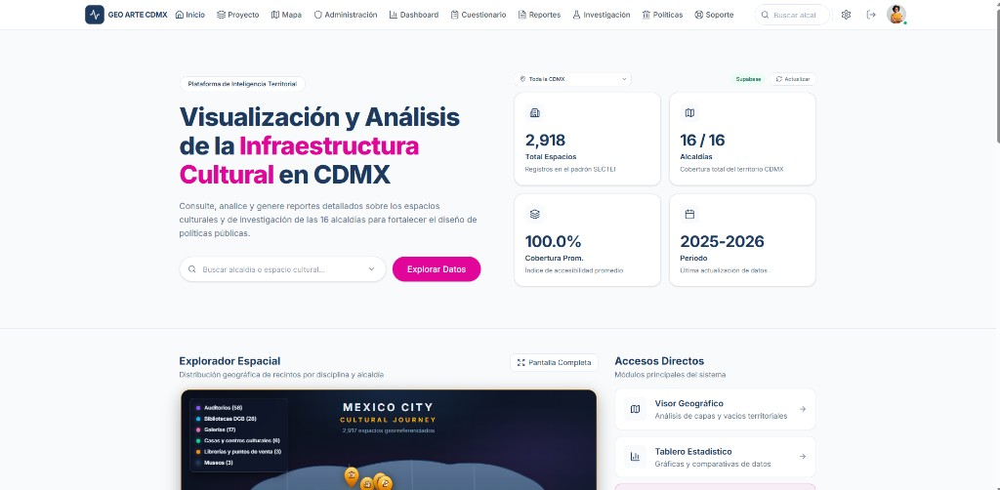

*Figura 1 — Barra superior con los módulos principales de la plataforma.*

### 2.2 Pie de página (Footer)

Cuatro columnas con enlaces rápidos:

| Columna | Enlaces |
|---------|---------|
| **Explorar** | Mapa GIS, Estadísticas, Cuestionario, Investigación, Recomendaciones |
| **Recursos** | Proyecto, Datos Abiertos (API), Documentación, FAQ |
| **Contacto** | Redes sociales, Buzón de Sugerencias |
| **Legal** | Aviso de Privacidad, Términos de Uso, Accesibilidad |

---

## 3. Autenticación y los tres perfiles

### 3.1 Descripción de cada perfil

| Perfil | Icono | Para quién es | Descripción |
|--------|-------|---------------|-------------|
| **Ciudadano** | Usuario | Público general | Consulta mapas, guarda espacios favoritos y participa en la plataforma |
| **Investigador** | Microscopio | Académicos y analistas | Accede a datos, reportes, exportaciones y repositorio cualitativo |
| **Autoridad** | Escudo | Funcionarios públicos | Administra espacios, capas SIG, validaciones y usuarios |

> **Importante:** al iniciar sesión debes elegir el **mismo perfil** con el que te registraste. Si no coincide, verás un error como: *«Esta cuenta está registrada como investigador, no como ciudadano»*.

### 3.2 Iniciar sesión (`/login`)

**Pasos:**

1. Abre **Iniciar sesión** desde el menú de usuario o visita `/login`.
2. En **Tipo de perfil**, elige Ciudadano, Investigador o Autoridad.
3. Ingresa **correo** y **contraseña** (mínimo 6 caracteres).
4. Pulsa **Entrar**.

**Redirección tras login:**

| Perfil | Destino por defecto |
|--------|---------------------|
| Ciudadano | `/perfil` |
| Investigador | `/perfil` |
| Autoridad | `/admin` |

**Cuentas de demostración** (modo sin Supabase, contraseña `demo123`):

| Correo | Perfil |
|--------|--------|
| `ciudadano@geoarte.mx` | Ciudadano |
| `investigador@geoarte.mx` | Investigador |
| `autoridad@geoarte.mx` | Autoridad |

### 3.3 Crear cuenta (`/registro`)

**Campos comunes:** nombre, correo, contraseña, confirmación, aceptación de términos.

**Campos adicionales:**

| Perfil | Campos extra |
|--------|--------------|
| Investigador | Institución u organización · Área de investigación |
| Autoridad | Institución u organización · Cargo o área |

Con Supabase activo, el correo debe **verificarse** antes de usar funciones completas (`/verificar-email`).

---

## 4. Matriz de acceso por rol

| Funcionalidad | Visitante | Ciudadano | Investigador | Autoridad |
|---------------|:---------:|:---------:|:------------:|:---------:|
| Inicio, Proyecto, Mapa, Dashboard, Cuestionario, Investigación, Políticas, Contacto | ✅ | ✅ | ✅ | ✅ |
| Ver menú **Administración** | ❌ | ❌ | ❌ | ✅ |
| Entrar a `/admin` | ❌ | ❌ | ❌ | ✅ |
| **Mi Perfil** | ❌ | ✅ | ✅ | ✅ |
| Guardar espacios en mapa | ❌ | ✅ | ✅ | ✅ |
| **Reportes** y exportaciones remotas | ❌ | ✅* | ✅ | ✅ |
| Exportar PDF/Excel del Dashboard | ❌ | ✅* | ✅ | ✅ |
| Gestionar padrón, usuarios y capas | ❌ | ❌ | ❌ | ✅ |

\* Requiere cuenta Supabase verificada.

### Flujos de trabajo recomendados

**Ciudadano**
```
Inicio → Mapa (explorar y guardar) → Políticas (contexto) → Perfil (recursos guardados)
```

**Investigador**
```
Dashboard (filtros) → Investigación (cualitativo) → Reportes (exportar) → Perfil (historial)
```

**Autoridad**
```
Admin (mantenimiento) → Mapa (validar georreferencia) → Dashboard (supervisión) → Logs (auditoría)
```

---

# Parte II — Manual del Ciudadano

## 5. Resumen del perfil Ciudadano

Como **Ciudadano** puedes:

- Explorar el mapa de infraestructura cultural sin necesidad de cuenta.
- Buscar alcaldías y espacios culturales cercanos.
- Consultar indicadores de brecha territorial y recomendaciones de política.
- **Con sesión:** guardar espacios favoritos, generar reportes y mantener historial de descargas.

**No puedes:** acceder al panel de Administración ni modificar el padrón oficial.

---

## 6. Inicio

**Ruta:** `/` · **Acceso:** público

### Propósito

Panorama ejecutivo de la infraestructura cultural: indicadores clave, vista previa del mapa y alertas de brecha territorial.

### Secciones de la pantalla

#### A. Hero — Plataforma de inteligencia territorial

- Título: *Visualización y Análisis de la Infraestructura Cultural en CDMX*.
- Búsqueda por alcaldía o espacio cultural.
- Botón **Explorar Datos** → navega al mapa.


*Figura 2 — Pantalla principal con búsqueda y acceso rápido al mapa.*

#### B. Indicadores clave (4 KPIs)

| KPI | Qué muestra |
|-----|-------------|
| **Total Espacios** | Conteo del padrón georreferenciado |
| **Alcaldías** | Cobertura territorial (ej. `16 / 16`) |
| **Cobertura Prom.** | Índice promedio de accesibilidad |
| **Periodo** | Corte de datos (año o semestre) |

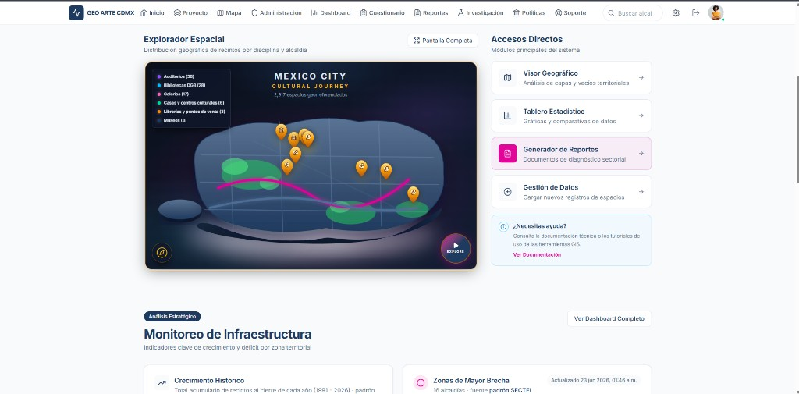

*Figura 3 — KPIs principales del padrón SECTEI.*

#### C. Explorador espacial

- Mini-mapa con distribución de espacios por tipología (auditorios, bibliotecas, museos, etc.).
- Contador de espacios georreferenciados.
- Botón **Pantalla Completa** / **Abrir mapa completo**.

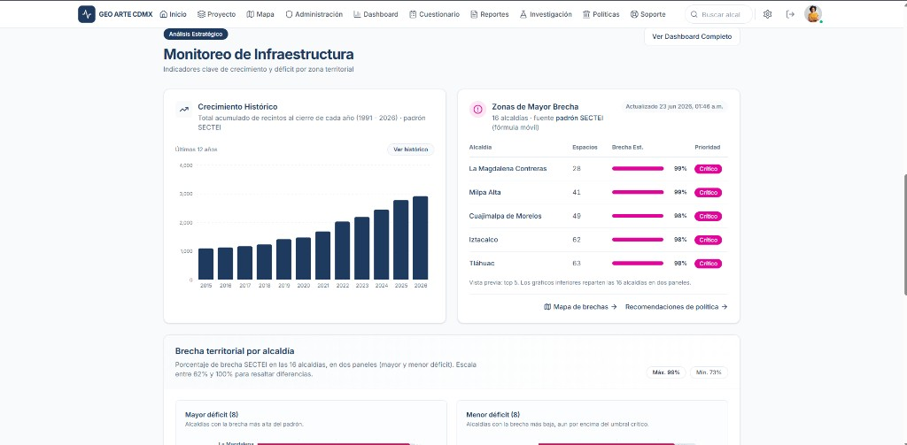

*Figura 4 — Vista previa del mapa con leyenda de tipologías.*

#### D. Accesos directos

| Tarjeta | Destino | Uso para el ciudadano |
|---------|---------|----------------------|
| Visor Geográfico | `/mapa` | Encontrar espacios cerca de ti |
| Tablero Estadístico | `/dashboard` | Ver estadísticas por alcaldía |
| Generador de Reportes | `/reportes` | Informes personalizados *(requiere sesión)* |
| Gestión de Datos | `/admin` | No disponible para tu perfil |

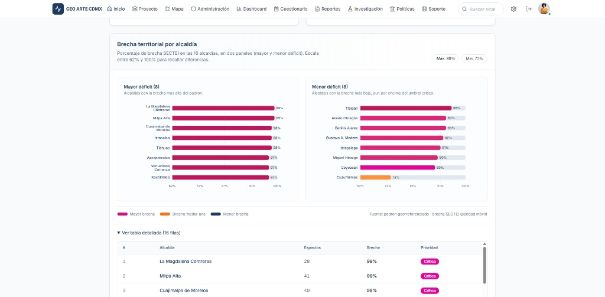

*Figura 5 — Atajos a los módulos principales.*

#### E. Monitoreo de infraestructura

Vista previa del dashboard con:

- **Crecimiento histórico** del padrón (1991–2026).
- **Zonas de mayor brecha** — alcaldías con déficit crítico.
- Enlace **Ver Dashboard Completo**.

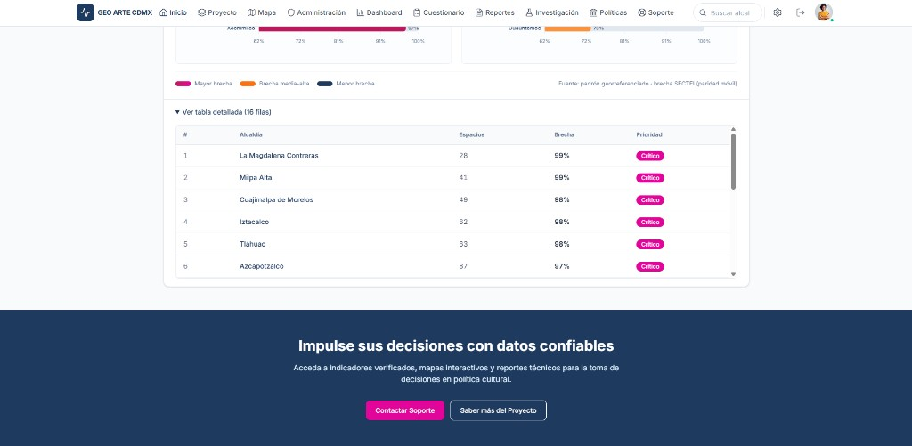

*Figura 6 — Resumen de crecimiento y brechas territoriales.*

### Pasos rápidos — Ciudadano

1. Abre **Inicio** y revisa los KPIs de tu ciudad.
2. Escribe el nombre de tu alcaldía en la búsqueda.
3. Pulsa **Explorar Datos** para ver espacios en el mapa.

---

## 7. Proyecto

**Ruta:** `/sobre-el-proyecto` · **Acceso:** público

### Propósito

Conocer la misión, metodología, equipo y colaboradores del proyecto GEO ARTE CDMX.

### Contenido principal

| Bloque | Descripción |
|--------|-------------|
| **Hero** | *Cartografiando el ADN Cultural de la Ciudad de México* |
| **Objetivos estratégicos** | Visibilidad territorial, análisis de brechas, datos abiertos, impacto en políticas |
| **Metodología** | Recolección → georreferenciación → validación → publicación |
| **Equipo y colaboradores** | UNAM-PUEC, Sec. Cultura CDMX, ADIP, UNESCO México |
| **Licencia de datos** | Condiciones de reutilización |

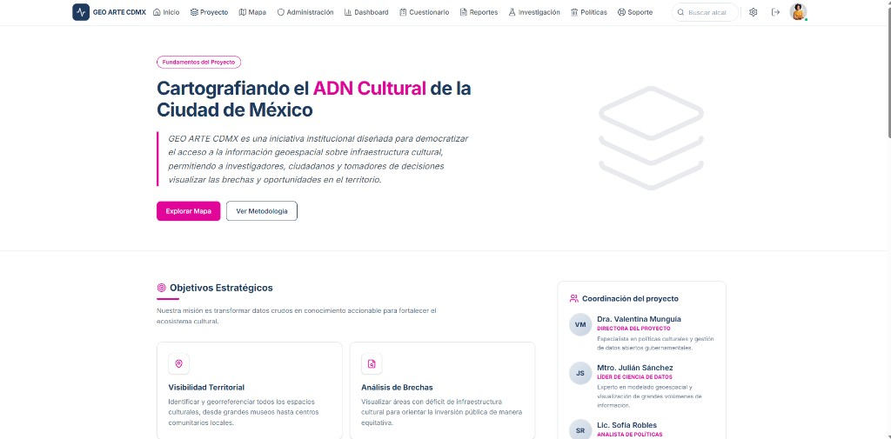

*Figura 7 — Los cuatro pilares estratégicos de la plataforma.*


*Figura 8 — Proceso de curación y validación de datos.*

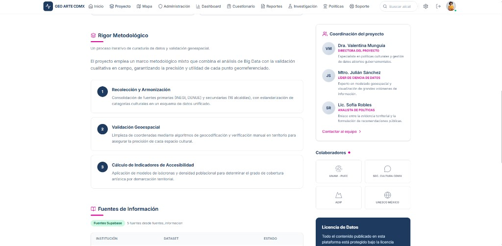

*Figura 9 — Equipo directivo y enlace de contacto.*

### Uso recomendado

- Consulta **Ver Metodología** antes de citar datos en trabajos escolares o comunitarios.
- Revisa la **licencia de datos** si planeas reutilizar información.

---

## 8. Mapa interactivo

**Ruta:** `/mapa` · **Acceso:** público

### Propósito

Visor GIS principal para localizar espacios culturales, consultar fichas y —con sesión— guardar favoritos.

### Vista general

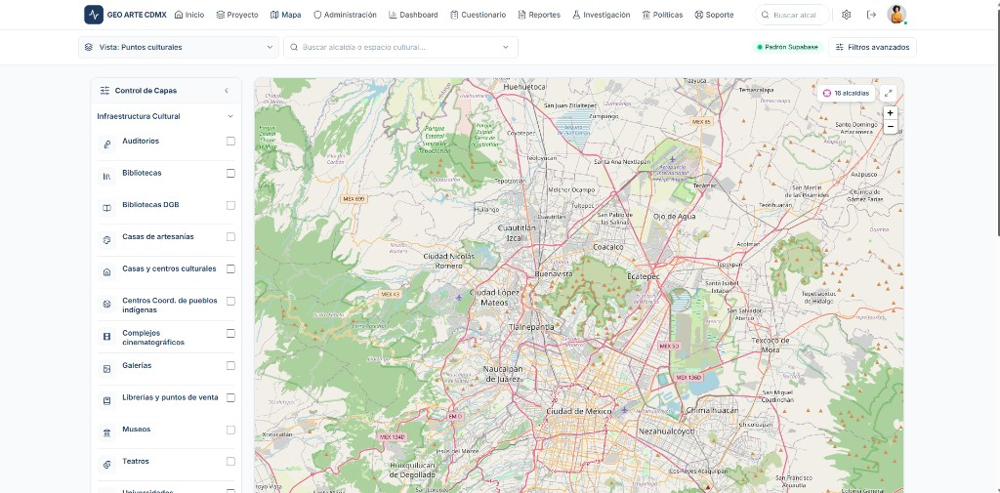

*Figura 10 — Visor geográfico con búsqueda, capas y mapa de CDMX.*

### Controles superiores

| Control | Función |
|---------|---------|
| **Vista: Puntos culturales** | Cambia el modo de visualización |
| **Búsqueda** | Filtra por alcaldía o nombre de espacio |
| **Padrón Supabase** | Indicador de conexión en vivo |
| **Filtros avanzados** | Tipología, brecha mínima, vacíos culturales |
| **Pantalla completa** | Expande el mapa |

### Panel de capas (izquierda)

Activa o desactiva las **12 tipologías SIC**:

1. Auditorios · 2. Bibliotecas · 3. Bibliotecas DGB · 4. Casas de artesanías  
5. Casas y centros culturales · 6. Centros coord. pueblos indígenas  
7. Complejos cinematográficos · 8. Galerías · 9. Librerías y puntos de venta  
10. Museos · 11. Teatros · 12. Universidades

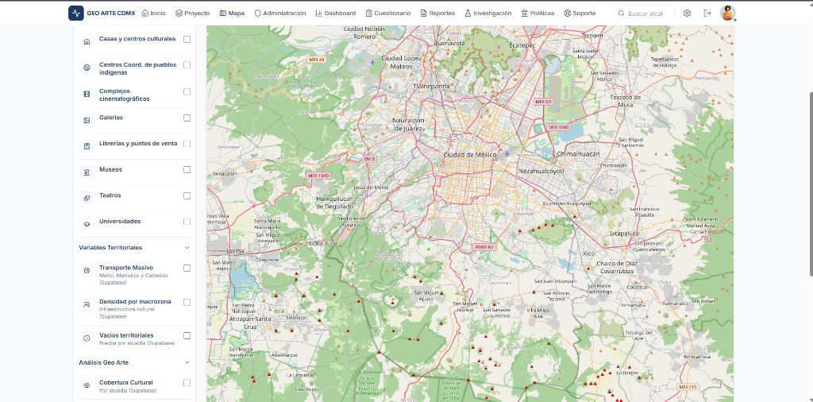

*Figura 11 — Panel lateral para activar tipologías de infraestructura.*

### Capas territoriales avanzadas

Para análisis más profundo (también útil si eres investigador):

| Capa | Qué representa |
|------|----------------|
| **Transporte masivo** | Metro, Metrobús, Cablebús |
| **Densidad por macrozona** | Concentración de infraestructura |
| **Vacíos territoriales** | Zonas con déficit cultural |
| **Cobertura cultural** | Índice por alcaldía |
| **Recursos cualitativos** | Entrevistas y encuestas georreferenciadas |

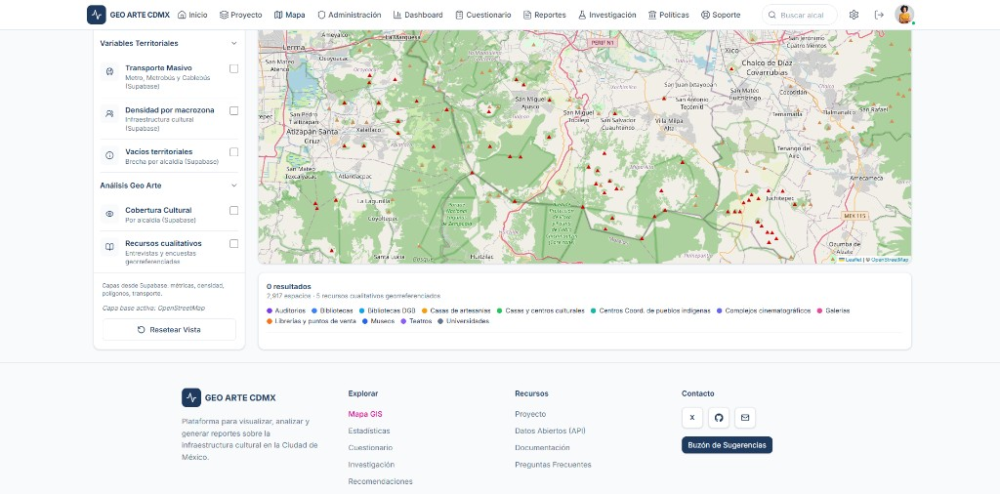

*Figura 12 — Capas de análisis territorial adicionales.*

### Interacción con un espacio (paso a paso)

1. **Haz clic** en un pin del mapa.
2. Se abre el **panel inferior** con foto, tipología, dirección y datos de contacto.
3. Pulsa **Cómo llegar** → abre Google Maps con las coordenadas.
4. Si tienes sesión: **Guardar espacio** / **Quitar de guardados**.
5. Sin sesión verás: *«Inicia sesión para guardar»*.

### Compartir un espacio

Copia la URL del navegador; incluirá parámetros como `?espacio=ID` o coordenadas (`lat`, `lng`).

---

## 9. Dashboard (consulta)

**Ruta:** `/dashboard` · **Acceso:** público (exportaciones requieren sesión)

### Propósito

Análisis cuantitativo del padrón: gráficos, brechas por alcaldía y comparación territorial.

### Vista de monitoreo

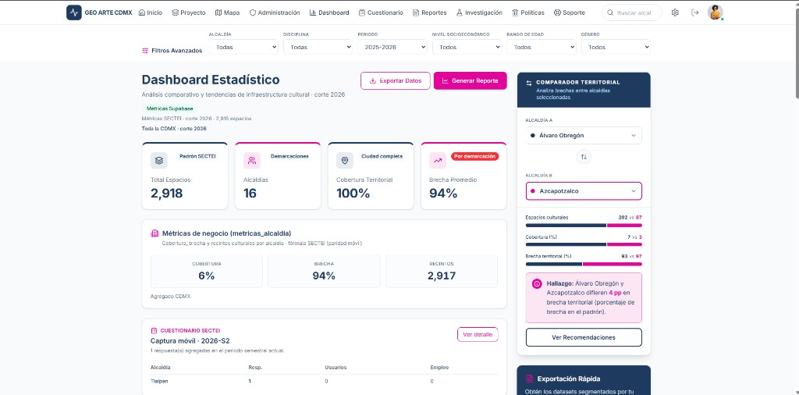

*Figura 13 — Vista general del tablero estadístico.*

### Gráficos principales

**Crecimiento histórico** — evolución del padrón SECTEI por año:

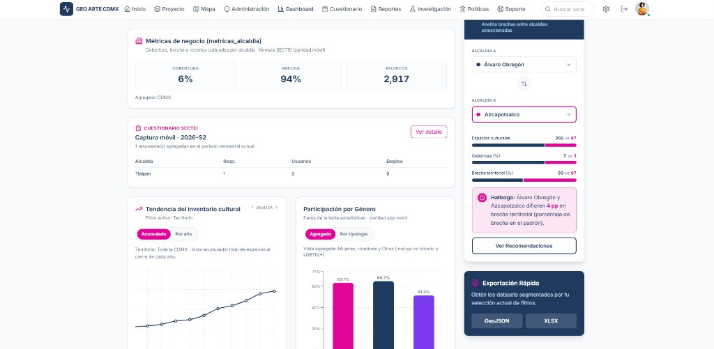

*Figura 14 — Gráfico de barras con acumulado de espacios (1991–2026).*

**Brecha territorial por alcaldía** — las 16 demarcaciones en dos paneles (mayor y menor déficit):

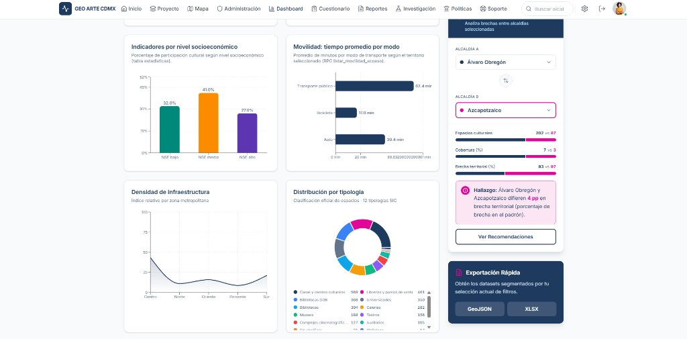

*Figura 15 — Barras horizontales con % de brecha SECTEI y leyenda de prioridad.*

| Prioridad | Color | Significado |
|-----------|-------|-------------|
| **Crítico** | Rosa | Brecha muy alta; intervención urgente |
| **Atención** | Naranja | Brecha media-alta |
| **Estable** | Azul | Situación relativamente equilibrada |

### Tabla detallada

Despliega **Ver tabla detallada (16 filas)** para ver alcaldía, número de espacios, brecha y prioridad.

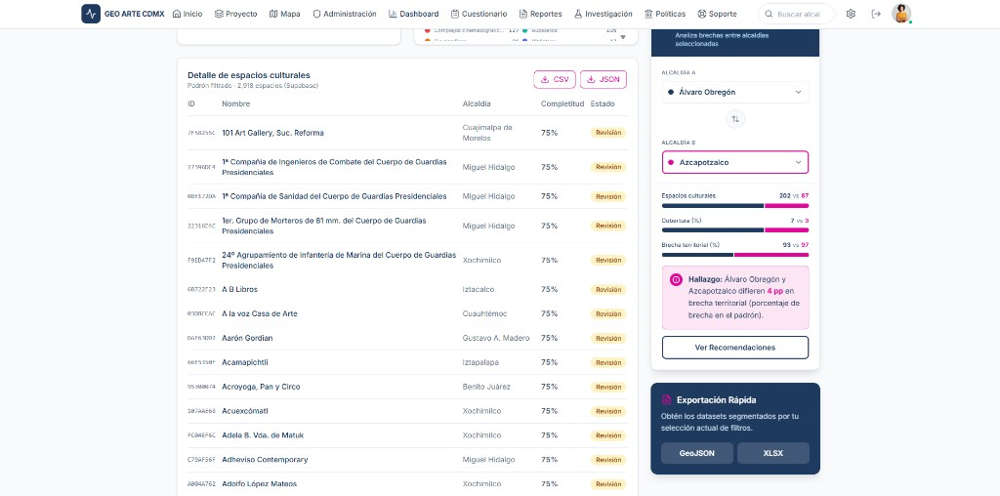

*Figura 16 — Detalle por demarcación con badge de prioridad.*

### Cómo leer los datos — Ciudadano

- Busca **tu alcaldía** en la tabla o en el gráfico de brechas.
- Si aparece en **Crítico**, significa que hay un déficit importante de infraestructura cultural respecto a la demanda estimada.
- Usa el enlace **Mapa de brechas** para ver la distribución geográfica.

---

## 10. Cuestionario (consulta)

**Ruta:** `/cuestionario` · **Acceso:** público

### Propósito

Consultar el resumen de la **captura semestral SECTEI** de espacios culturales. La captura se realiza en la **app móvil GeoArteCDMX**; la web muestra los datos sincronizados.

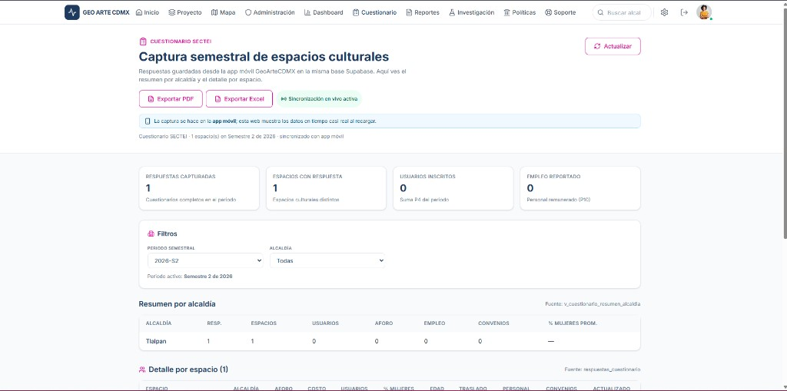

*Figura 17 — Panel de cuestionario con KPIs y filtros.*

### Indicadores del periodo

| KPI | Descripción |
|-----|-------------|
| **Respuestas capturadas** | Cuestionarios completados en el semestre |
| **Espacios con respuesta** | Espacios culturales distintos |
| **Usuarios inscritos** | Suma de participantes reportados |
| **Empleo reportado** | Personal remunerado declarado |

### Filtros

- **Periodo semestral** (ej. `2026-S2`).
- **Alcaldía** (Todas o una demarcación específica).

### Tablas de datos

1. **Resumen por alcaldía** — respuestas, espacios, usuarios, aforo, empleo, convenios, % mujeres.
2. **Detalle por espacio** — ficha individual con aforo, costo, demografía y fecha de actualización.

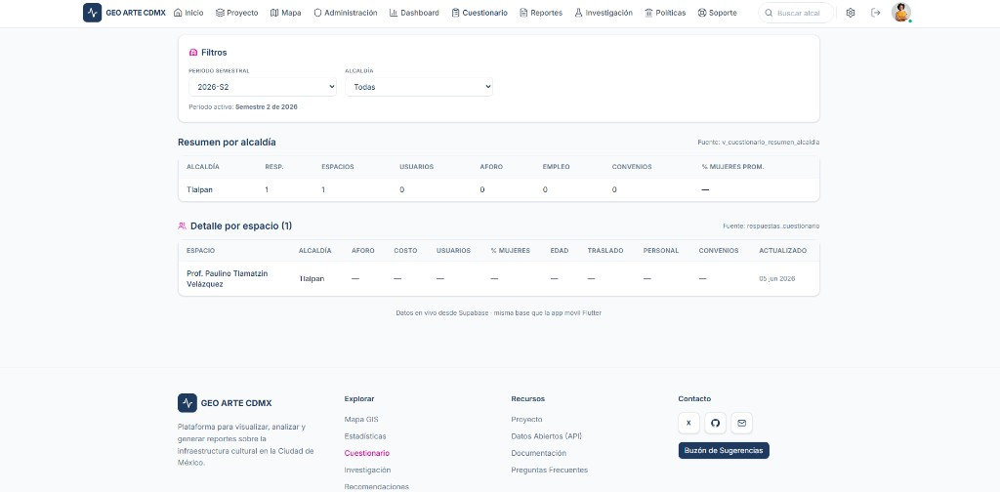

*Figura 18 — Resumen territorial y detalle por espacio cultural.*

> **Nota:** La captura de datos nuevos se hace desde la app móvil. En la web solo consultas y, con sesión de Investigador o Autoridad, exportas (PDF/Excel).

---

## 11. Políticas públicas

**Ruta:** `/politicas` · **Acceso:** público

### Propósito

Conocer las **recomendaciones de política pública** derivadas del diagnóstico territorial: intervenciones planificadas, presupuesto e impacto social.

### Hero — Recomendaciones de política pública

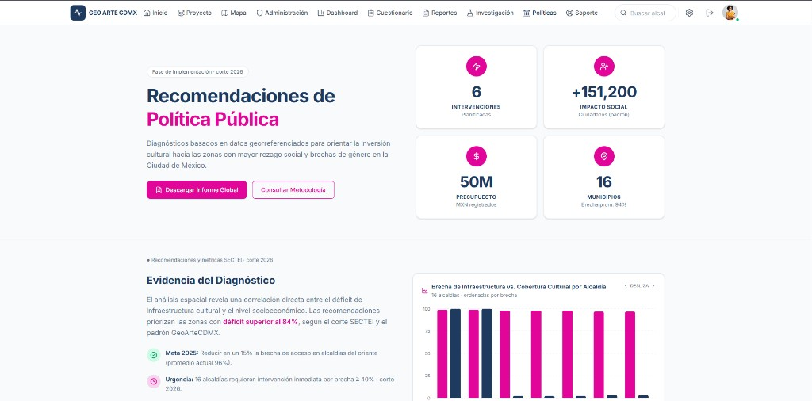

*Figura 19 — Indicadores de intervenciones, impacto social, presupuesto y cobertura municipal.*

| KPI | Contenido |
|-----|-----------|
| Intervenciones | Acciones planificadas |
| Impacto social | Ciudadanos estimados beneficiados |
| Presupuesto | MXN registrados |
| Municipios | Alcaldías cubiertas y brecha promedio |

### Evidencia del diagnóstico

Texto narrativo + gráfico comparativo de brecha vs. cobertura por alcaldía.

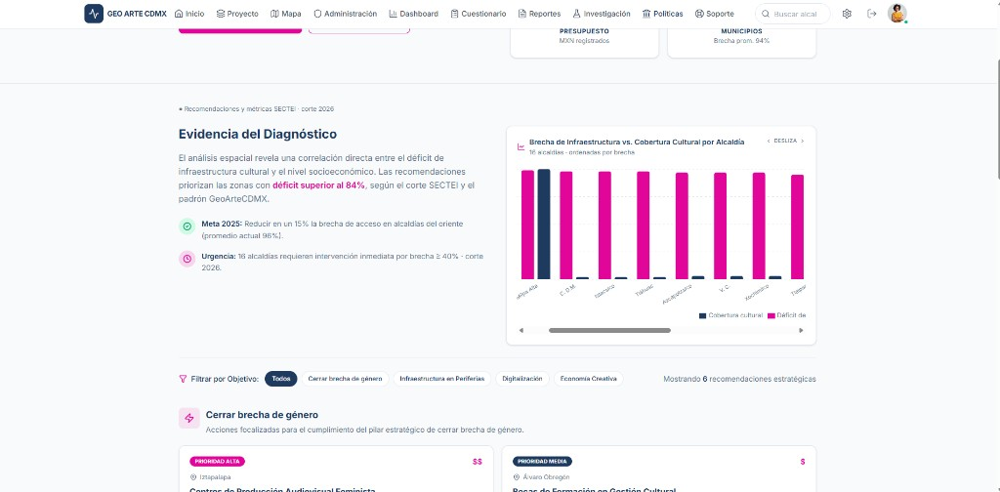

*Figura 20 — Gráfico de barras: déficit de infraestructura vs. cobertura cultural.*

### Recomendaciones estratégicas

Filtra por objetivo: *Todos · Cerrar brecha de género · Infraestructura en periferias · Digitalización · Economía creativa*.

Cada tarjeta incluye:

- **Prioridad** (Alta / Media / Baja).
- **Costo estimado** ($ a $$$).
- **Alcaldía objetivo**.
- **Impacto estimado** en ciudadanos.
- Botón **Descargar Brief de Acción** (PDF).

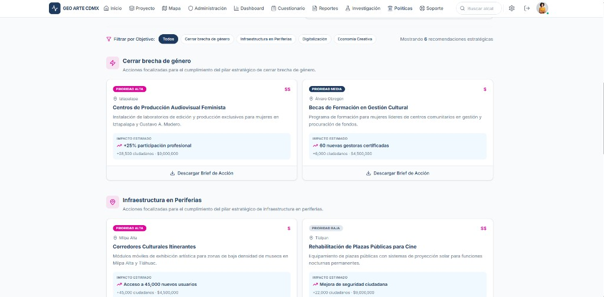

*Figura 21 — Tarjetas de acción con prioridad, ubicación e impacto.*

### Generar reporte por alcaldía

Al final de la página, el bloque **¿Necesitas una propuesta personalizada?** permite obtener un diagnóstico específico de tu demarcación.

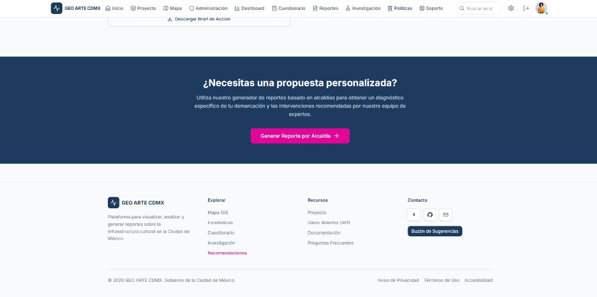

*Figura 22 — CTA para reporte territorial personalizado.*

---

## 12. Soporte y contacto

**Ruta:** `/contacto` · **Acceso:** público

### Secciones

**A. Buzón de consultas** — formulario con nombre, correo, asunto y mensaje.

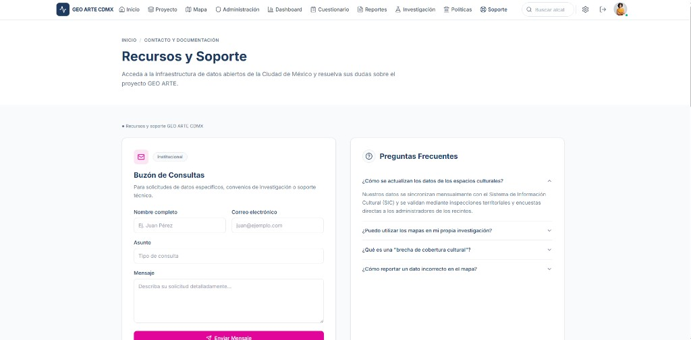

*Figura 23 — Formulario de contacto y envío de consultas.*

**B. Preguntas frecuentes** — acordeón con temas operativos.

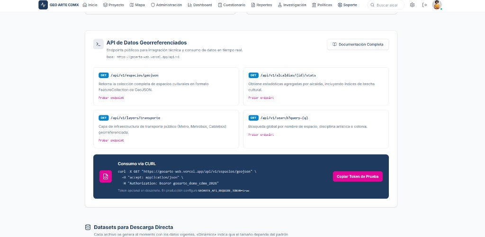

*Figura 24 — FAQ sobre uso del mapa, datos y licencias.*

**C. API de datos abiertos** — endpoints, ejemplo cURL y token de acceso.

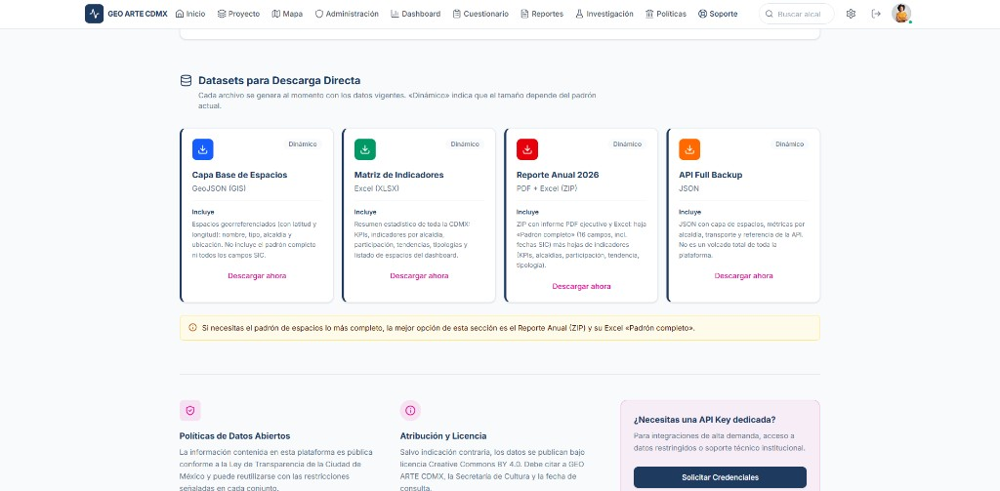

*Figura 25 — Documentación de la API pública.*

**D. Datasets** — catálogo de conjuntos descargables (GeoJSON, CSV).

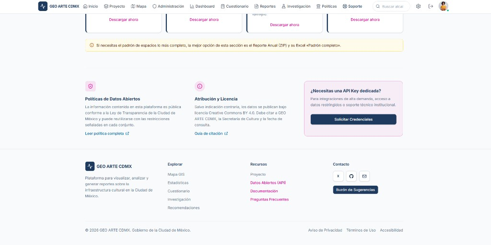

*Figura 26 — Conjuntos de datos disponibles para descarga.*

---

## 13. Mi perfil (Ciudadano)

**Ruta:** `/perfil` · **Requisito:** sesión activa

### Cabecera

- Avatar, nombre, badge de rol **Ciudadano**.
- Estadísticas: recursos guardados, reportes generados.

### Pestaña «Mis Recursos»

Lista de **espacios culturales guardados** desde el mapa.

| Acción | Descripción |
|--------|-------------|
| Filtrar por tipo | Desplegable con tipologías |
| Abrir | Enlace al mapa centrado en el espacio |
| Eliminar | Quita de favoritos |
| Explorar mapa | Descubrir más espacios |

### Pestaña «Historial»

Registro de exportaciones y descargas (PDF, Excel) con opción de volver a descargar.

### Pestaña «Configuración»

- Editar nombre para mostrar.
- Subir avatar.
- Correo (solo lectura).

---

# Parte III — Manual del Investigador

## 14. Resumen del perfil Investigador

Como **Investigador** tienes acceso a **todo lo del Ciudadano**, más:

- Filtros avanzados y exportaciones masivas en el Dashboard.
- Centro de **Reportes** con plantillas institucionales (PDF y Excel).
- Repositorio de **Investigación cualitativa** (entrevistas, encuestas, grupos focales).
- Exportación de recursos individuales (JSON, CSV, PDF).
- Acceso a la **API de datos abiertos** para integración con herramientas externas.

**No puedes:** administrar el padrón, cambiar roles de usuario ni publicar espacios.

### Registro

Al crear cuenta debes indicar **Institución u organización** y **Área de investigación**.

---

## 15. Dashboard avanzado y exportaciones

Además de la consulta pública (ver [sección 9](#9-dashboard-consulta)), como investigador usarás:

### Barra de filtros avanzados

Seis selectores que recalculan KPIs, gráficos y tabla:

| Filtro | Opciones | Efecto |
|--------|----------|--------|
| Alcaldía | Todas + 16 demarcaciones | Vista local o nacional |
| Disciplina | Música, Teatro, Artes visuales, Danza… | Filtra espacios y participación |
| Periodo | Años académicos | Cambia el corte de métricas |
| NSE | Bajo, Medio, Alto | Segmentación socioeconómica |
| Rango de edad | 18-29, 30-44, 45-59, 60+ | Participación por edad |
| Género | Mujer, Hombre, No binario/otro | Equidad de participación |

### Comparador territorial

Selecciona **Alcaldía A** y **Alcaldía B** para comparar espacios, cobertura y brecha. El sistema genera un hallazgo automático con la diferencia en puntos porcentuales.

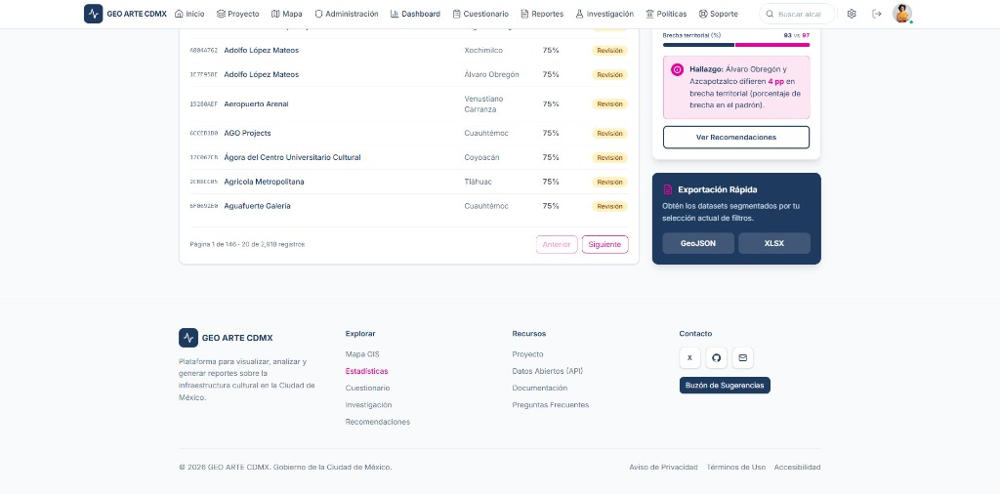

*Figura 27 — Panel lateral para comparar dos demarcaciones.*

### Exportaciones disponibles

| Formato | Contenido | Dónde |
|---------|-----------|-------|
| **PDF** | Informe visual del tablero | Botón «Exportar Datos» |
| **XLSX** | Libro multi-hoja (KPIs, participación, tendencia, espacios) | Panel inferior |
| **CSV / JSON** | Padrón filtrado | Tabla de espacios |
| **GeoJSON** | Geometrías con propiedades | Panel inferior |

Ver [Anexo A](#anexo-a-referencia-de-kpis-y-gráficos) para detalle de columnas exportadas.

---

## 16. Centro de reportes

**Ruta:** `/reportes` · **Requisito:** sesión con Supabase verificada

### Vista general

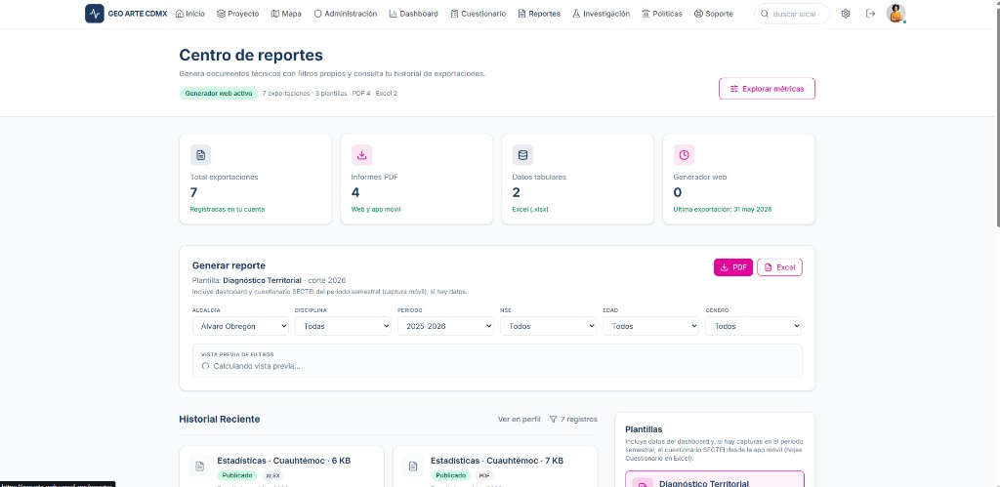

*Figura 28 — KPIs personales de exportación y acceso al generador.*

### Generar un reporte — paso a paso

1. **Elige una plantilla:**

   | Plantilla | Contenido | Formatos |
   |-----------|-----------|----------|
   | Diagnóstico Territorial | Brechas y cobertura por demarcación | PDF, Excel |
   | Impacto Social | Participación por género, NSE y edad | PDF, Excel |
   | Resumen Ejecutivo | Panorama CDMX para autoridades | PDF, Excel |

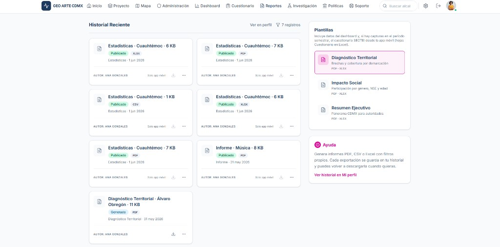

*Figura 29 — Selección de plantilla y filtros.*

2. **Ajusta filtros** (mismos ejes que Dashboard): alcaldía, disciplina, periodo, NSE, edad, género.
3. Revisa la **vista previa** del resumen de filtros.
4. Pulsa **PDF** o **Excel** para generar y descargar.
5. El archivo queda en tu **Historial de exportaciones**.

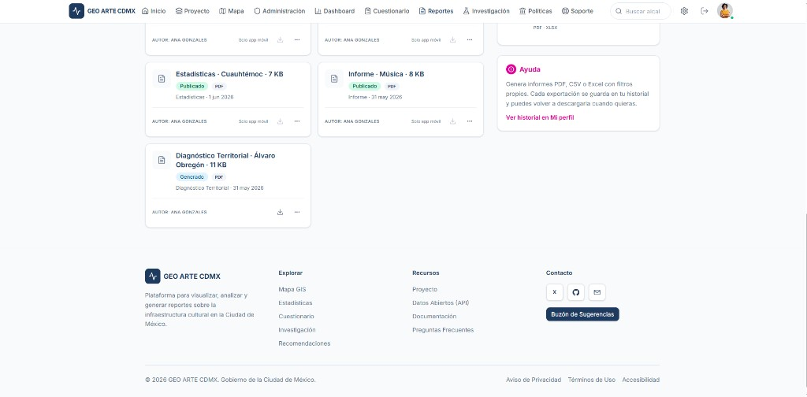

*Figura 30 — Registro de informes generados con opción de re-descarga.*

### Contenido del Excel (.xlsx)

| Hoja | Contenido |
|------|-----------|
| Resumen | Filtros aplicados y total de espacios |
| KPIs | Indicadores del tablero |
| Participación | Porcentajes por género |
| Tendencia | Serie anual del padrón |
| Espacios | Padrón filtrado con columnas completas |

---

## 17. Investigación y repositorio cualitativo

**Ruta:** `/investigacion` · **Acceso:** público (exportaciones requieren sesión)

### Propósito

Consultar **datos cualitativos geolocalizados**: entrevistas, encuestas, grupos focales y materiales de campo.

### Vista del repositorio

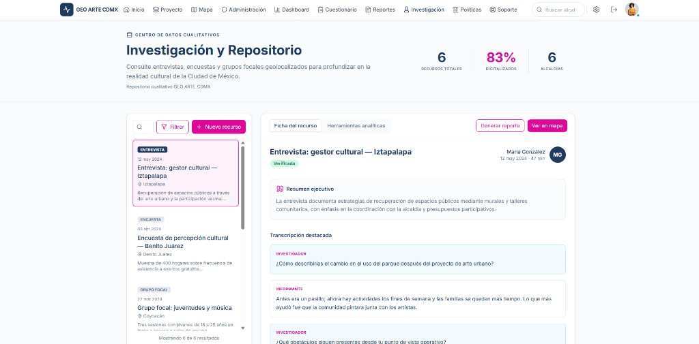

*Figura 31 — Catálogo de recursos con KPIs y panel de detalle.*

### KPIs de cabecera

| KPI | Cálculo |
|-----|---------|
| Recursos totales | Entradas activas en catálogo |
| Digitalizados | % con flag `digitalizado = true` |
| Alcaldías | Demarcaciones con al menos un recurso |

### Panel izquierdo — catálogo

- **Búsqueda** por texto en título o resumen.
- **Filtros:** tipo de recurso, alcaldía.
- Lista paginada con tipo, fecha, título y badge de verificación.

**Tipos:** Entrevista · Encuesta · Grupo focal.

### Panel derecho — detalle

**Pestaña Ficha del recurso:**

- Título, investigador, fecha, alcaldía, duración.
- Resumen ejecutivo.
- Transcripción por turnos (Investigador / Informante).
- Badge **Verificado** si pasó validación institucional.

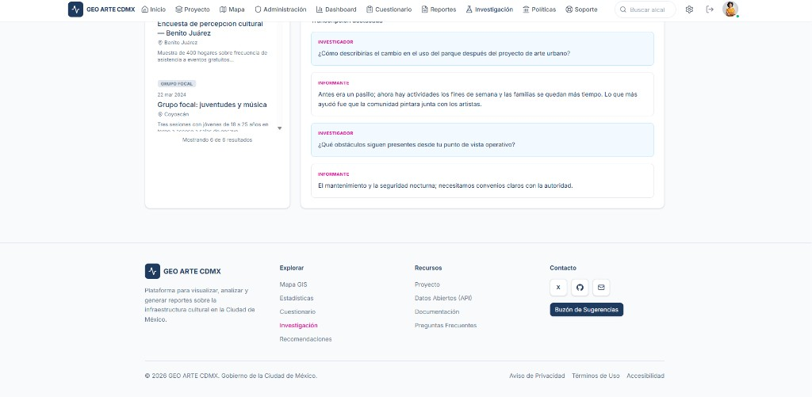

*Figura 32 — Diálogo estructurado entre investigador e informante.*

**Pestaña Herramientas analíticas:**

| Acción | Resultado |
|--------|-----------|
| Generar reporte | PDF del recurso |
| Exportar JSON | Archivo estructurado |
| Exportar CSV | Tabla resumida |
| Ver en mapa | `/mapa?recurso=ID&lat=…&lng=…` |

### Flujo de trabajo — Investigador

```
1. Filtrar recursos por alcaldía o tipo
2. Leer ficha y transcripción
3. Exportar JSON/CSV para análisis externo (NVivo, Atlas.ti, etc.)
4. Ver en mapa para contexto territorial
5. Cruzar con datos cuantitativos del Dashboard
```

---

## 18. Mi perfil (Investigador)

Igual estructura que el Ciudadano ([sección 13](#13-mi-perfil-ciudadano)), con énfasis en:

- **Historial** de exportaciones PDF/Excel generadas en Reportes y Dashboard.
- **Recursos guardados** de mapas y datasets para seguimiento de investigación.
- Badge de rol **Investigador** con institución y área de investigación en el subtítulo.

---

# Parte IV — Manual de la Autoridad

## 19. Resumen del perfil Autoridad

Como **Autoridad** tienes acceso **completo** a la plataforma, incluyendo el **Panel de Administración** (`/admin`).

### Responsabilidades principales

| Área | Acciones |
|------|----------|
| **Padrón** | Crear, editar, publicar y georreferenciar espacios culturales |
| **Capas SIG** | Gestionar capas cartográficas y sincronizar el mapa territorial |
| **Políticas** | Editar recomendaciones mostradas en `/politicas` |
| **Investigación** | Alta y validación de recursos cualitativos |
| **Reportes** | Gestionar plantillas del centro de reportes |
| **Usuarios** | Crear cuentas y cambiar roles (Ciudadano / Investigador / Autoridad) |
| **Consultas** | Atender mensajes del buzón de contacto |
| **Auditoría** | Revisar logs del sistema |

### Registro

Al crear cuenta debes indicar **Institución u organización** y **Cargo o área**.

### Acceso al panel

Tras iniciar sesión como Autoridad, la aplicación te redirige automáticamente a `/admin`.

---

## 20. Panel de administración

**Ruta:** `/admin` · **Requisito:** rol Autoridad + Supabase

### Vista general

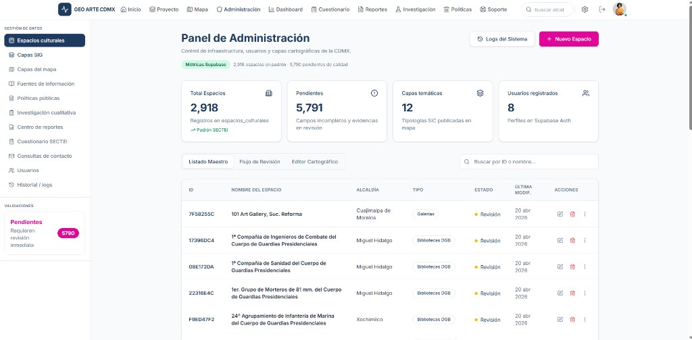

*Figura 33 — Cabecera del panel con indicadores y acceso a logs.*

### KPIs administrativos

| KPI | Origen |
|-----|--------|
| Total Espacios | Espacios activos georreferenciados |
| Pendientes | Registros en estado Revisión |
| Capas SIG | Capas con `activo = true` |
| Usuarios activos | Perfiles con sesión reciente |

### Menú lateral (secciones)

| Sección | Función |
|---------|---------|
| Espacios culturales | CRUD del padrón SECTEI |
| Capas SIG | Catálogo de capas vectoriales/raster |
| Capas del mapa | Sincronización territorial |
| Fuentes de información | Metadatos de procedencia |
| Políticas públicas | Editor de recomendaciones |
| Investigación cualitativa | Alta/edición de recursos |
| Centro de reportes | Plantillas de exportación |
| Cuestionario | Revisión de respuestas SECTEI |
| Consultas de contacto | Bandeja del buzón |
| Usuarios | Gestión de cuentas y roles |
| Historial / Logs | Auditoría del sistema |
| Pendientes | Cola de validaciones |

> Documentación ampliada: [Panel de administración](PANEL-ADMINISTRACION.md) · [Control de capas del mapa](CONTROL-DE-CAPAS-MAPA.md)

---

## 21. Gestión del padrón y publicación

### Listado maestro de espacios

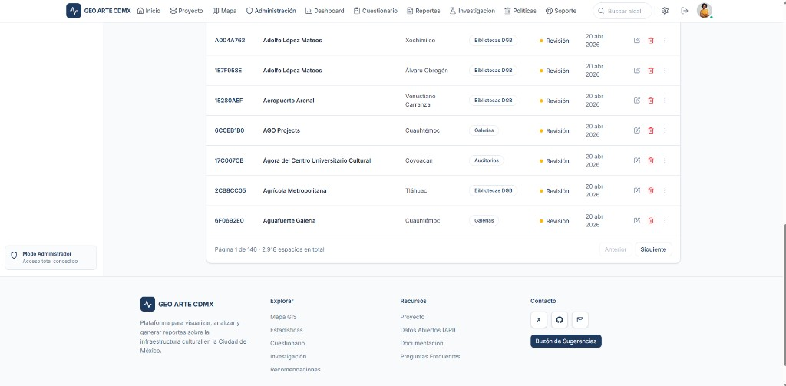

*Figura 34 — Tabla maestra con búsqueda, estados y acciones.*

| Columna | Descripción |
|---------|-------------|
| ID | Identificador del registro |
| Nombre | Denominación oficial |
| Alcaldía | Demarcación territorial |
| Tipo | Tipología SIC |
| Estado | Borrador · Revisión · Publicado |
| Acciones | Editar · Eliminar |

### Ciclo de vida del espacio

```
Borrador → Revisión → Publicado
```

- Solo espacios **Publicados** aparecen en el mapa y estadísticas públicas.
- Usa el **Flujo de revisión** (vista Kanban) para mover espacios entre columnas.
- El **Editor cartográfico** permite asignar latitud/longitud a espacios sin coordenadas.

### Crear un espacio nuevo

1. Pulsa **+ Nuevo Espacio** en la cabecera del panel.
2. Completa nombre, tipología, alcaldía, dirección y datos de contacto.
3. Asigna coordenadas en el editor cartográfico.
4. Mueve a **Revisión** y, tras validar, a **Publicado**.

---

## 22. Capas SIG y sincronización del mapa

### Capas SIG

CRUD del catálogo de capas:

- Nombre, tipo, URL de servicio, estado activo/inactivo.
- Las capas activas alimentan el visor público y el KPI «Capas SIG».

### Capas del mapa — sincronización

Panel operativo para actualizar datos territoriales:

| Capa | Contenido |
|------|-----------|
| Métricas | Indicadores por alcaldía |
| Densidad | Macrozonas |
| Geometrías | Polígonos territoriales |
| Transporte | Metro, Metrobús, Cablebús |

**Procedimiento tras una migración de base de datos:**

1. Admin → **Capas del mapa**.
2. Pulsa **Sincronizar** (ejecuta pipeline `sync:mapa`).
3. Verifica en **Logs** que la sincronización se registró correctamente.
4. Abre `/mapa` y confirma que las capas se visualizan.

---

## 23. Políticas, investigación y reportes (admin)

### Políticas públicas

Editor de las recomendaciones visibles en `/politicas`:

- Secciones por objetivo estratégico.
- Acciones con prioridad, costo, alcaldía, impacto estimado.
- Publicar o desactivar entradas.

### Investigación cualitativa

Alta y edición de recursos del repositorio público:

| Campo | Descripción |
|-------|-------------|
| Tipo | Entrevista, encuesta, grupo focal |
| Título, alcaldía, investigador | Metadatos |
| Resumen y transcripción | Contenido (JSON estructurado) |
| Coordenadas | Opcionales para geolocalización en mapa |
| Flags | Verificado · Digitalizado · Activo |

### Centro de reportes (admin)

Gestión de **plantillas** disponibles en `/reportes`:

- Título, descripción, categoría.
- Formatos permitidos (PDF, Excel).
- Filtros por defecto al seleccionar la plantilla.

### Cuestionario (admin)

Revisión de respuestas capturadas desde la app móvil:

- Consulta por periodo semestral y alcaldía.
- Cambio de estatus de revisión institucional.
- Exportación PDF/Excel para informes oficiales.

---

## 24. Usuarios, consultas y auditoría

### Gestión de usuarios

| Acción | Descripción |
|--------|-------------|
| **Crear usuario** | Correo, nombre, rol inicial |
| **Cambiar rol** | Ciudadano / Investigador / Autoridad |
| **Listar cuentas** | Todas las cuentas registradas |

> Solo una **Autoridad** puede reasignar roles. Los usuarios no pueden cambiar su propio rol desde la interfaz pública.

### Consultas de contacto

Bandeja de mensajes del buzón `/contacto`:

- Listado con fecha, correo, asunto.
- Modal de detalle.
- Marcar como atendida.

### Historial / Logs

Auditoría consolidada:

- Altas y cambios de espacios, capas, usuarios.
- Sincronizaciones de mapa.
- Exportaciones relevantes.
- Filtro por fecha y tipo de evento.

### Pendientes

Cola de **validaciones institucionales**: contenido en revisión, consultas sin responder, espacios incompletos. El badge numérico en el menú indica ítems que requieren atención.

### Flujo diario recomendado — Autoridad

```
1. Revisar badge de Pendientes
2. Atender consultas de contacto
3. Publicar espacios en revisión
4. Sincronizar mapa si hubo cambios en BD
5. Supervisar Dashboard (brechas críticas)
6. Revisar logs al cierre del día
```

---

# Anexos

## Anexo A. Referencia de KPIs y gráficos

### A.1 Inicio

| Elemento | Qué mide | Fuente |
|----------|----------|--------|
| Total Espacios | Registros georreferenciados | Padrón SECTEI |
| Alcaldías | Demarcaciones con cobertura | Métricas territoriales |
| Cobertura Prom. | Media de índice de accesibilidad | `metricas_alcaldia` |
| Crecimiento padrón | Espacios por año | Serie existencia anual |
| Brecha por alcaldía | % déficit + prioridad | Brecha territorial SECTEI |

### A.2 Dashboard — KPIs

**Vista nacional (Alcaldía = Todas):** Total Espacios · 16 Alcaldías · Cobertura Territorial · Brecha Promedio.

**Vista local:** Espacios en demarcación · Cobertura local · Brecha territorial · Tipologías activas.

### A.3 Dashboard — Gráficos

| Gráfico | Interpretación |
|---------|----------------|
| Participación por Género | Equidad por tipología SIC |
| Existencia anual del padrón | Crecimiento histórico |
| Densidad de infraestructura | Concentración por macrozona |
| Distribución por tipología | Composición del padrón |
| Comparador A vs B | Diferencia entre dos alcaldías |

### A.4 Exportación del padrón — columnas

Aplica a Excel, CSV, JSON y GeoJSON:

| Columna | Descripción |
|---------|-------------|
| ID del espacio | UUID en `espacios_culturales` |
| Nombre | Denominación oficial |
| Tipología SIC | Tipo oficial |
| Alcaldía | Demarcación territorial |
| Dirección | Domicilio |
| Latitud / Longitud | Coordenadas WGS84 |
| Completitud (%) | Índice 0–100 |
| Estado editorial | Publicado · Revisión · Borrador |

---

## Anexo B. Glosario

| Término | Definición |
|---------|------------|
| **Padrón SECTEI** | Inventario oficial de espacios culturales de CDMX |
| **Tipología SIC** | Clasificación oficial del tipo de espacio (12 categorías) |
| **Brecha territorial** | % de déficit de infraestructura respecto a la demanda estimada |
| **Cobertura** | % de satisfacción del índice de accesibilidad cultural |
| **Completitud** | % de campos obligatorios llenos en un registro |
| **Recurso cualitativo** | Entrevista, encuesta u otro material de investigación de campo |
| **Macrozona** | Agrupación: Centro, Sur, Oriente, Poniente, Norte |
| **NSE** | Nivel socioeconómico (Bajo, Medio, Alto) |
| **Corte / anioCorte** | Año de referencia de las métricas mostradas |

---

## Anexo C. Preguntas frecuentes

**¿Puedo usar la plataforma sin registrarme?**  
Sí. Inicio, Proyecto, Mapa, Dashboard, Cuestionario, Investigación, Políticas y Contacto son públicos. Necesitas cuenta para guardar espacios, generar reportes y acceder a Admin.

**¿Por qué no veo el menú Administración?**  
Solo aparece con sesión de **Autoridad**.

**¿Por qué los números del Dashboard no cambian al filtrar?**  
En modo demo algunos indicadores son estáticos. Con Supabase, verifica el badge verde.

**¿Cómo comparto un espacio del mapa?**  
Copia la URL del navegador tras seleccionar el espacio; incluirá `?espacio=ID`.

**¿Puedo cambiar mi rol después del registro?**  
No desde la interfaz pública. Una **Autoridad** puede reasignar roles en Admin → Usuarios.

**¿Dónde se capturan los datos del cuestionario?**  
En la **app móvil GeoArteCDMX**. La web muestra el resumen sincronizado en tiempo real.

**¿Cómo actualizo las capas del mapa?**  
Como Autoridad: Admin → Capas del mapa → **Sincronizar**.

---

## Anexo D. Documentación relacionada

| Documento | Descripción |
|-----------|-------------|
| [Panel de administración](PANEL-ADMINISTRACION.md) | Guía detallada del módulo `/admin` |
| [Control de capas del mapa](CONTROL-DE-CAPAS-MAPA.md) | Gestión y sincronización de capas GIS |
| [Índice de entrega](INDICE-ENTREGA.md) | Paquete completo de documentación |
| [Instalación](../tecnico/INSTALACION.md) | Requisitos técnicos y variables de entorno |

### Índice de imágenes

| Archivo | Módulo | Descripción |
|---------|--------|-------------|
| `inicio-hero.png` | Inicio | Hero y navegación |
| `inicio-kpis.png` | Inicio | Indicadores clave |
| `inicio-explorador.png` | Inicio | Mini-mapa |
| `inicio-accesos.png` | Inicio | Accesos directos |
| `inicio-monitoreo.png` | Inicio | Monitoreo de infraestructura |
| `proyecto-objetivos.png` | Proyecto | Objetivos estratégicos |
| `proyecto-metodologia.png` | Proyecto | Metodología |
| `proyecto-equipo.png` | Proyecto | Equipo directivo |
| `mapa-vista-general.png` | Mapa | Visor GIS |
| `mapa-capas.png` | Mapa | Control de capas |
| `mapa-variables.png` | Mapa | Variables territoriales |
| `dashboard-monitoreo.png` | Dashboard | Vista general |
| `dashboard-crecimiento.png` | Dashboard | Crecimiento histórico |
| `dashboard-brecha.png` | Dashboard | Brecha por alcaldía |
| `dashboard-tabla.png` | Dashboard | Tabla detallada |
| `dashboard-comparador.png` | Dashboard | Comparador A vs B |
| `cuestionario-resumen.png` | Cuestionario | KPIs y filtros |
| `cuestionario-tablas.png` | Cuestionario | Tablas de datos |
| `politicas-hero.png` | Políticas | Cabecera y KPIs |
| `politicas-evidencia.png` | Políticas | Evidencia del diagnóstico |
| `politicas-recomendaciones.png` | Políticas | Tarjetas de acción |
| `politicas-reporte-alcaldia.png` | Políticas | Reporte por alcaldía |
| `reportes-centro.png` | Reportes | Centro de reportes |
| `reportes-plantillas.png` | Reportes | Plantillas |
| `reportes-historial.png` | Reportes | Historial |
| `investigacion-repositorio.png` | Investigación | Repositorio |
| `investigacion-transcripcion.png` | Investigación | Transcripción |
| `soporte-buzon.png` | Soporte | Buzón de consultas |
| `soporte-faq.png` | Soporte | FAQ |
| `soporte-api.png` | Soporte | API |
| `soporte-datasets.png` | Soporte | Datasets |
| `admin-panel.png` | Admin | Panel general |
| `admin-espacios.png` | Admin | Gestión de espacios |

---

*GEO ARTE CDMX · Gobierno de la Ciudad de México · Manual de usuario v2.0*
